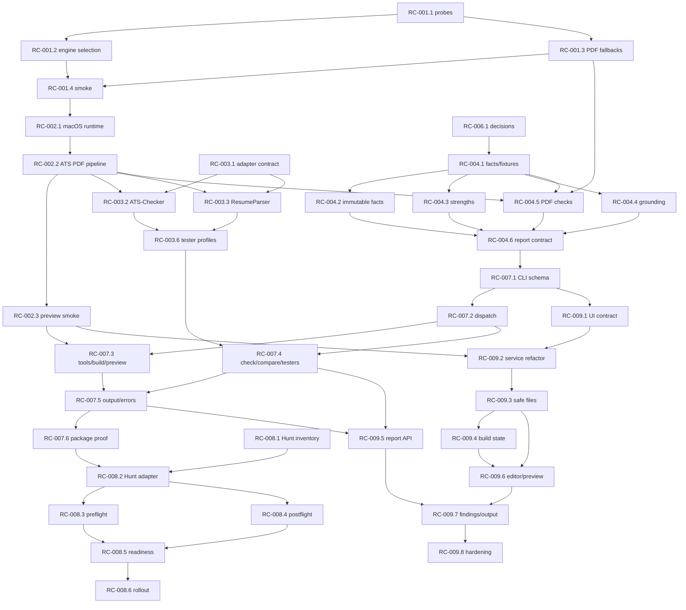

# Resume Cooker Implementation Backlog

This directory is the durable execution catalog. Nine `RC-00X` pages define product epics; 46
`RC-00X.Y` pages define bounded work packages. Contributors execute work packages, not whole epics.

Accepted product behavior lives in [`docs/product-decisions.md`](../product-decisions.md). Current
assignments, dated verification, environment state, and next command live in the private project
handoff, not this public repository.

## Task Contract

Every work package has one outcome plus exact status gate, owned surfaces, inputs/outputs, scope,
sequence, acceptance/verification, failure/privacy constraints, and handoff evidence. A package is
execution-ready only when all hard dependencies and named external conditions are satisfied.

Epic pages remain useful for shared context, non-goals, and end-state acceptance. Their implementation
slices are descriptive; child packages are the source of truth for execution boundaries.

## Status Model

| Status        | Meaning                                                                   |
| ------------- | ------------------------------------------------------------------------- |
| `ready`       | Hard prerequisites satisfied; work can start without product decision.    |
| `blocked`     | Exact prerequisite or external condition prevents completion.             |
| `in_progress` | Contributor owns package and has begun implementation.                    |
| `review`      | Implementation and required evidence are ready for review.                |
| `done`        | Package acceptance, verification, privacy, and handoff requirements pass. |
| `deferred`    | Work intentionally postponed with reason and revisit trigger.             |

`partial` may describe an epic whose code scaffolds exist, but it is not a work-package execution
status. Do not infer `done` from commit messages, file presence, or mocked tests alone.

## Evaluation Profiles

- **Normal local:** deterministic checks remain useful offline. Missing optional PDF/tester tools
  produce explicit incomplete evidence without making installation part of root CI.
- **Strict release:** requires a known page count and executed ATS-Checker integration. Missing either
  is exit `69`, unavailable required capability.
- **API advisory:** separately explicit opt-in. Provider findings cannot be the sole hard blocker.

## Package-Level Critical Path



External conditions—macOS access, usable native/container runtime, live API authorization, and Hunt
repository access—are intentionally not represented as fake implementation tasks.

## Work-Package Registry

### RC-001: Truthful Capability Detection

| Package                                           | Outcome                                     | Hard dependencies                           |
| ------------------------------------------------- | ------------------------------------------- | ------------------------------------------- |
| [RC-001.1](RC-001.1-capability-probe-contract.md) | Structured command/Docker capability probes | None                                        |
| [RC-001.2](RC-001.2-pdf-engine-selection.md)      | Capability-aware PDF engine selection       | RC-001.1                                    |
| [RC-001.3](RC-001.3-pdf-tool-fallbacks.md)        | Truthful extraction/page fallbacks          | RC-001.1                                    |
| [RC-001.4](RC-001.4-toolchain-smoke-and-docs.md)  | Real unavailable/usable smoke evidence      | RC-001.2, RC-001.3, runtime for usable path |

### RC-002: Proven PDF Pipeline

| Package                                            | Outcome                          | Hard dependencies            |
| -------------------------------------------------- | -------------------------------- | ---------------------------- |
| [RC-002.1](RC-002.1-macos-runtime.md)              | Reproducible macOS runtime       | RC-001.4, macOS host/runtime |
| [RC-002.2](RC-002.2-ats-pdf-pipeline.md)           | ATS build/page/text report       | RC-002.1                     |
| [RC-002.3](RC-002.3-preview-and-artifact-smoke.md) | Preview/artifact/lifecycle proof | RC-002.1, RC-002.2           |

### RC-003: Tester Integrations

| Package                                           | Outcome                              | Hard dependencies           |
| ------------------------------------------------- | ------------------------------------ | --------------------------- |
| [RC-003.1](RC-003.1-tester-adapter-contract.md)   | Shared adapter/outcome contract      | None                        |
| [RC-003.2](RC-003.2-ats-checker-integration.md)   | ATS-Checker parser agreement         | RC-003.1, RC-002.2          |
| [RC-003.3](RC-003.3-resume-parser-integration.md) | ResumeParser structural evidence     | RC-003.1, RC-002.2          |
| [RC-003.4](RC-003.4-ats-screener-integration.md)  | ats-screener local scoring           | RC-003.1, RC-002.2          |
| [RC-003.5](RC-003.5-resume-matcher-operation.md)  | Useful bounded operation or deferral | RC-003.1, RC-003.2–RC-003.4 |
| [RC-003.6](RC-003.6-tester-profiles.md)           | Normal/strict profiles               | RC-003.2, RC-003.3          |

### RC-004: Postflight Regression Gate

| Package                                            | Outcome                                 | Hard dependencies            |
| -------------------------------------------------- | --------------------------------------- | ---------------------------- |
| [RC-004.1](RC-004.1-compare-fixtures-and-facts.md) | Synthetic fixtures and normalized facts | RC-006.1                     |
| [RC-004.2](RC-004.2-immutable-fact-comparison.md)  | Immutable fact regressions              | RC-004.1                     |
| [RC-004.3](RC-004.3-strength-retention.md)         | Protected strengths/omissions           | RC-004.1                     |
| [RC-004.4](RC-004.4-jd-grounding.md)               | Grounded addition analysis              | RC-004.1                     |
| [RC-004.5](RC-004.5-postflight-pdf-checks.md)      | Actual PDF/text inspection              | RC-001.3, RC-002.2, RC-004.1 |
| [RC-004.6](RC-004.6-postflight-report-contract.md) | Versioned aggregate report              | RC-004.2–RC-004.5, RC-006.1  |

### RC-005: Live API Validation

| Package                                            | Outcome                                      | Hard dependencies                                |
| -------------------------------------------------- | -------------------------------------------- | ------------------------------------------------ |
| [RC-005.1](RC-005.1-api-smoke-guardrails.md)       | Authorization, fixtures, budget, secret plan | Explicit user authorization                      |
| [RC-005.2](RC-005.2-openrouter-live-validation.md) | OpenRouter live synthetic proof              | RC-005.1, scoped key, network                    |
| [RC-005.3](RC-005.3-anthropic-live-validation.md)  | Anthropic live synthetic proof               | RC-005.1, scoped key, network                    |
| [RC-005.4](RC-005.4-provider-readiness.md)         | Honest provider classification               | Provider smoke evidence; both for full readiness |

### RC-006: Product Contracts

| Package                                              | Outcome                      | Hard dependencies  |
| ---------------------------------------------------- | ---------------------------- | ------------------ |
| [RC-006.1](RC-006.1-publish-product-decisions.md)    | Publish accepted D1-D8       | Approved decisions |
| [RC-006.2](RC-006.2-documentation-contract-audit.md) | Align public docs            | RC-006.1           |
| [RC-006.3](RC-006.3-release-dependency-gates.md)     | Validate package/stage gates | RC-006.1, RC-006.2 |

### RC-007: Standalone CLI

| Package                                             | Outcome                          | Hard dependencies            |
| --------------------------------------------------- | -------------------------------- | ---------------------------- |
| [RC-007.1](RC-007.1-cli-schema-contract.md)         | Grammar/schema/exit contract     | RC-004.6, RC-006.1           |
| [RC-007.2](RC-007.2-cli-dispatch-and-validation.md) | Binary dispatch/input validation | RC-007.1                     |
| [RC-007.3](RC-007.3-cli-tools-build-preview.md)     | Tools/build/preview commands     | RC-001.3, RC-002.3, RC-007.2 |
| [RC-007.4](RC-007.4-cli-check-compare-testers.md)   | Check/compare/tester commands    | RC-003.6, RC-004.6, RC-007.2 |
| [RC-007.5](RC-007.5-cli-output-and-errors.md)       | Streams/errors/reports/signals   | RC-007.3, RC-007.4           |
| [RC-007.6](RC-007.6-cli-package-verification.md)    | Package/cross-platform proof     | RC-007.5                     |

### RC-008: Hunt And Fletcher Integration

| Package                                         | Outcome                              | Hard dependencies              |
| ----------------------------------------------- | ------------------------------------ | ------------------------------ |
| [RC-008.1](RC-008.1-hunt-surface-inventory.md)  | Evidence-based integration inventory | Current Hunt repository access |
| [RC-008.2](RC-008.2-hunt-process-adapter.md)    | Validated CLI process adapter        | RC-007.6, RC-008.1             |
| [RC-008.3](RC-008.3-hunt-preflight-policy.md)   | Preflight/default/override policy    | RC-008.2, RC-006.1             |
| [RC-008.4](RC-008.4-hunt-postflight.md)         | Post-Fletcher comparison             | RC-004.6, RC-008.2             |
| [RC-008.5](RC-008.5-hunt-readiness-mapping.md)  | Namespaced flags/C3 readiness        | RC-008.3, RC-008.4             |
| [RC-008.6](RC-008.6-hunt-end-to-end-rollout.md) | Enabled/failure/rollback proof       | RC-008.5                       |

### RC-009: Local Editing And Review UI

| Package                                          | Outcome                                | Hard dependencies            |
| ------------------------------------------------ | -------------------------------------- | ---------------------------- |
| [RC-009.1](RC-009.1-ui-v1-contract.md)           | Source/save/security/state contract    | RC-006.1, RC-007.1           |
| [RC-009.2](RC-009.2-preview-service-refactor.md) | Testable preview services              | RC-002.3, RC-009.1           |
| [RC-009.3](RC-009.3-safe-source-files.md)        | Approved source load/save              | RC-009.2                     |
| [RC-009.4](RC-009.4-build-operation-state.md)    | Cancellable/stale-safe builds          | RC-001.2, RC-009.2, RC-009.3 |
| [RC-009.5](RC-009.5-report-api.md)               | Versioned local report API             | RC-007.4, RC-007.5, RC-009.2 |
| [RC-009.6](RC-009.6-editor-preview-ui.md)        | Editor and current/stale PDF preview   | RC-009.3, RC-009.4           |
| [RC-009.7](RC-009.7-findings-tools-output-ui.md) | Findings/tools/privacy/saved output    | RC-009.5, RC-009.6           |
| [RC-009.8](RC-009.8-ui-hardening.md)             | Security/accessibility/lifecycle gates | RC-009.7                     |

## How To Pick Up A Package

1. Read this registry, the parent epic, the package page, and linked decisions.
2. Check private handoff for live status; rerun entry checks because historical blockers expire.
3. Run `git status --short --branch`; preserve unrelated user changes.
4. Confirm every hard dependency is `done` or narrow work to an explicitly independent unit-test
   slice described by the package.
5. Start with the first failing test or reproducible command named by the package.
6. Keep generated PDFs, extracted text, reports, logs, credentials, environments, and `node_modules`
   ignored.
7. Before review, execute every verification command and attach package-specific handoff evidence.

## Definition Of Done

A package is `done` only when its observable outcome exists, all in-scope acceptance criteria pass,
normal/fallback/failure tests are proportionate to risk, real smoke evidence covers behavior mocks
cannot prove, statuses/exits match D7, privacy boundaries hold, affected docs agree, and downstream
packages can consume the recorded result.

## Cross-Package Invariants

- Local checks remain useful offline.
- External review requires explicit consent every run.
- Reports state whether content left the machine.
- Preview artifacts and intentional saved outputs remain distinct.
- Missing optional tools are explicit; missing required capabilities exit `69`.
- No command claims an artifact exists without verifying it.
- Skips and parser/provider failures never become passes.
- Raw private values do not enter console output, findings, fixtures, screenshots, or committed logs.
- Stable statuses remain `pass`, `pass_with_warnings`, and `fail` within schema v1.

## Handoff Template

```text
Package: RC-00X.Y
Status: review
Environment: OS, architecture, Node/npm, relevant native/container/tester runtimes
Changed: files and observable behavior
Decisions: decision IDs or none
Verification:
- command -> exit/result/counts
Artifacts: ignored paths or none
Privacy: content-left-machine and secret/private-data audit
Skipped paths: path and exact reason
Remaining risks: bounded list
Unblocks: package IDs
Next command: exact command
```
