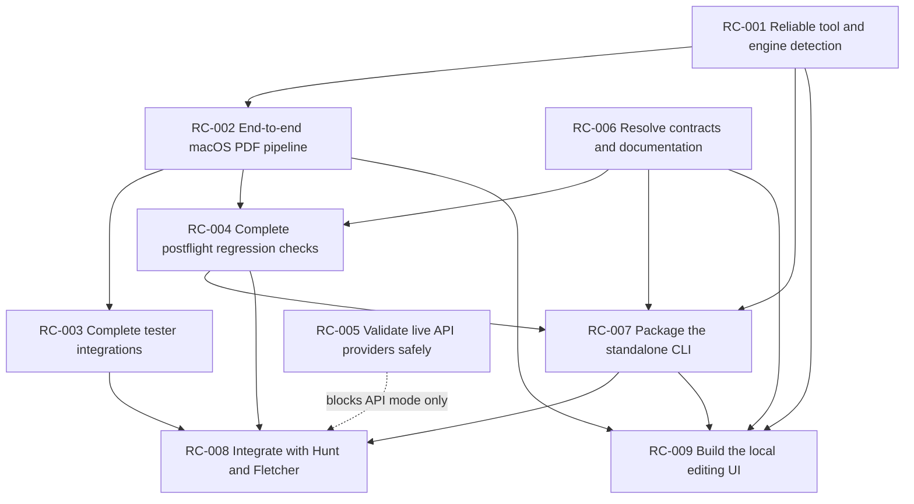

# Resume Cooker Implementation Backlog

This directory converts the remaining roadmap into pickup-ready engineering tasks. Each task is
scoped so a contributor can understand the problem, determine whether work can start, implement a
bounded change, and hand it off with reproducible evidence.

The task pages describe intended work. They do not imply that a task is active, assigned, or
complete. Confirm current repository state before starting.

## Documentation Boundary

This repository stores durable contributor-facing contracts:

- task purpose and scope;
- architectural dependencies;
- implementation surfaces and non-goals;
- acceptance criteria and verification requirements;
- privacy, compatibility, and handoff requirements.

Live execution state does not belong here. Current priorities, assignments, dated verification,
machine-specific blockers, active decision discussions, and the next command belong in the
project's private coordination and handoff system. This keeps public documentation portable and
prevents temporary state from becoming stale repository guidance.

## Status Model

Use one of these statuses when tracking a task in an issue, pull request, or handoff:

| Status        | Meaning                                                                                         |
| ------------- | ----------------------------------------------------------------------------------------------- |
| `ready`       | All hard prerequisites are satisfied. Work can start without a product decision.                |
| `blocked`     | A named external condition, prerequisite task, or unresolved decision prevents useful progress. |
| `in_progress` | A contributor owns the task and has begun implementation.                                       |
| `review`      | Implementation is complete enough for review; required evidence is attached.                    |
| `done`        | Acceptance criteria and verification requirements are satisfied.                                |
| `deferred`    | Work is intentionally postponed and the reason is recorded.                                     |

Do not use `blocked` for ordinary implementation difficulty. Record the exact blocking condition,
its owner if known, and the evidence that the condition still exists.

## Dependency Graph



Solid arrows are hard dependencies for the full task. The dotted edge means local-only Hunt
integration can proceed without live API validation, but API-backed integration cannot be called
production-ready until RC-005 is complete.

## Task Index

| ID                                         | Task                                       | Architectural prerequisites                         | Blocks                                 |
| ------------------------------------------ | ------------------------------------------ | --------------------------------------------------- | -------------------------------------- |
| [RC-001](RC-001-toolchain-detection.md)    | Make tool and engine detection truthful    | None                                                | RC-002, RC-007, RC-009                 |
| [RC-002](RC-002-macos-pdf-pipeline.md)     | Prove the macOS PDF pipeline end to end    | RC-001; usable TeX or Docker runtime                | RC-003, PDF portions of RC-004, RC-009 |
| [RC-003](RC-003-tester-integrations.md)    | Complete tester integrations               | RC-002; tester dependency strategy                  | RC-008 confidence and parser evidence  |
| [RC-004](RC-004-postflight-regressions.md) | Complete postflight regression checks      | RC-006 decisions; RC-002 for PDF checks             | RC-007, RC-008                         |
| [RC-005](RC-005-api-validation.md)         | Validate live API providers safely         | Explicit sample-data approval, key, and spend limit | API-backed RC-008 readiness            |
| [RC-006](RC-006-contract-decisions.md)     | Resolve contracts and align documentation  | Product decisions listed in the task                | RC-004, RC-007, RC-008, RC-009         |
| [RC-007](RC-007-packaged-cli.md)           | Package a stable standalone CLI            | RC-001, RC-004, RC-006                              | RC-008, RC-009                         |
| [RC-008](RC-008-hunt-integration.md)       | Integrate Resume Cooker with Hunt/Fletcher | RC-003, RC-004, RC-006, RC-007                      | C3 resume-quality gating               |
| [RC-009](RC-009-local-editing-ui.md)       | Build the local editing and review UI      | RC-001, RC-002, RC-006, RC-007                      | No current backend task                |

## How To Pick Up A Task

Before editing:

1. Read this index and the full task page.
2. Run `git status --short --branch`; do not overwrite unrelated user changes.
3. Rerun the task's entry checks. Historical blockers may already be gone.
4. Confirm every hard dependency marked `done`, or narrow the work to an explicitly independent
   slice listed by the task.
5. Record assumptions that affect behavior, privacy, compatibility, or report contracts.
6. If a decision is required, update RC-006 or link the decision record. Do not silently choose a
   contract with downstream effects.

During implementation:

- Keep generated PDFs, extracted text, logs, credentials, and reports out of Git.
- Preserve support for Windows, Linux, and macOS unless the task explicitly limits a test fixture.
- Keep `testers/` excluded from default root CI. Invoke tester tools only through explicit commands.
- Never enable external API calls merely because an API key exists.
- Add deterministic tests for new status, fallback, and error behavior.
- Keep public error messages actionable without exposing private resume or JD content.

Before handoff:

1. Run every verification command in the task.
2. Record exact pass, warning, fail, and skip counts.
3. State which optional paths were not exercised and why.
4. List generated artifacts without committing them.
5. Update affected docs and task dependency statements.
6. Leave a concise handoff with changed files, decisions, remaining risks, and the next executable
   command.

## Definition Of Ready

A task is ready when:

- Its desired behavior and non-goals are clear.
- All hard prerequisites are satisfied or the chosen slice is independent of them.
- Required external access, credentials, runtimes, and test data are available.
- Open contract decisions that change implementation have written answers.
- The contributor can name the first failing test or reproducible command.

## Definition Of Done

A task is done only when:

- All in-scope acceptance criteria pass.
- Unit tests cover normal, fallback, and failure behavior proportionate to risk.
- Real smoke tests cover integrations that mocks cannot prove.
- Reports and command exit codes match documented semantics.
- Privacy boundaries remain intact.
- Relevant README, roadmap, compatibility, and integration docs agree.
- No generated or private artifacts are tracked.
- Downstream tasks have enough evidence to remove the completed dependency.

## Cross-Task Invariants

These rules apply to every task:

- Local checks must remain useful offline.
- External review must remain explicit opt-in.
- Reports must say whether content left the machine.
- The saved-output command and temporary-preview command must remain distinct.
- Missing optional tools may warn or skip, but explicit requested operations must fail clearly when
  they cannot produce their promised artifact.
- A successful command must not claim an artifact exists without verifying it.
- A parser or provider failure must not silently become a pass.
- Private values must not appear in console output, report evidence, fixtures, or committed logs.
- Stable report statuses remain `pass`, `pass_with_warnings`, and `fail` unless RC-006 explicitly
  changes the contract.

## Evidence Template

Use this in an issue, pull request, or handoff:

```text
Task: RC-00X
Status: review
Environment: OS, architecture, Node/npm, relevant native tools or container runtime
Changed: concise file and behavior list
Decisions: links or "none"
Verification:
- command -> result
- command -> result
Artifacts: ignored paths or "none"
Privacy: whether content left the machine
Skipped paths: path and reason
Remaining risks: concise list
Unblocks: downstream task IDs
Next command: exact command for the next contributor
```
