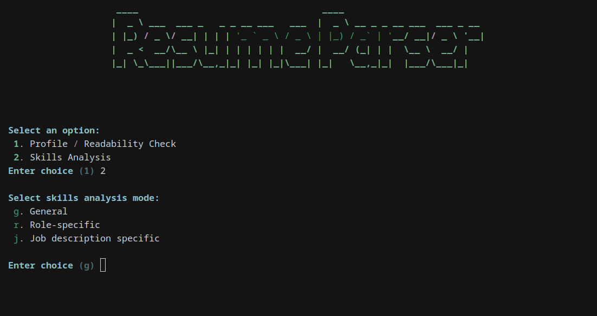
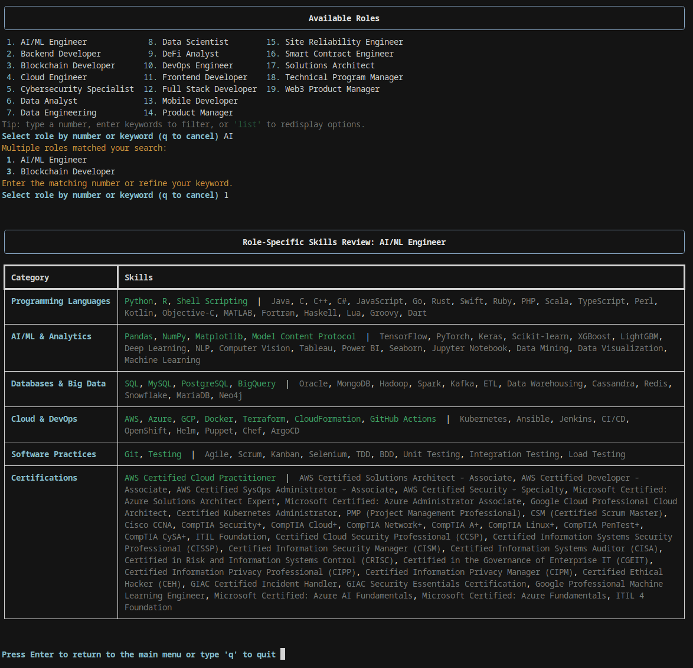
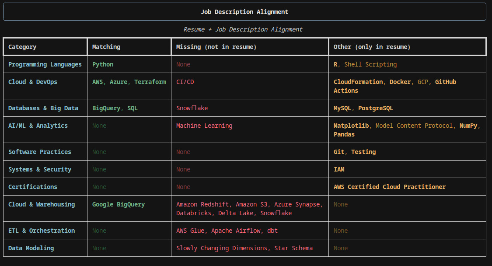

<h1 align="center">📄 Resume Parser </h1>
<p align="center"><em>Review how applicant tracking systems and recruiters read your resume — entirely offline.</em></p>

<div align="center">

[](LICENSE)
[](https://www.python.org/)
[](https://medium.com/@saraprettyman)
[](https://buymeacoffee.com/saraprettyman)



</div>

<div><br><br></div>

## 💡 Why This Exists
Applicant tracking systems (ATS) flatten formatting, strip bullets, and generally read your resume very differently than the polished PDF you send. Resume Parser gives you that plain-text view, shows how each major section gets interpreted, and provides actionable skill coverage feedback. Everything runs locally, so your résumé data never leaves your machine.

This is a project by **Digital Resume Solutions LLC**, built with a privacy-first mindset.

## 🧭 Features
- Launch `python -m resume_parser.cli` to open a Rich-powered terminal menu.
- Choose between a `Profile / Readability Check` and three `Skills Analysis` workflows (general, role-specific, job description alignment).
- Run multiple passes without restarting: the CLI remembers your last resume and job description paths and offers them as defaults.
- All parsing happens locally across PDFs, Word docs, text files, and HTML (`.pdf`, `.docx`, `.doc`, `.txt`, `.rtf`, `.odt`, `.md`, `.html`, `.htm`).
- Ships with a fake resume and job description so you can explore the flow immediately.

## 🚀 Quick Start
```bash
git clone https://github.com/saraprettyman/ResumeParser.git
cd ResumeParser
python -m venv .venv
source .venv/bin/activate  # or .venv\Scripts\activate on Windows
pip install -e .
resume-parser  # launches the interactive CLI
```
The editable install exposes a `resume-parser` console command (hyphenated, matching the project name) so you do not have to remember the package import path. Prefer `python -m resume_parser` if you want to run the module directly without installing the script. Accept the defaults to experiment with the bundled sample resume (`tests/data/fake_resumes/fake_resume.pdf`) and job description. The CLI clears the screen between steps so you can rerun checks without restarting.

## 📦 Release Notes

### v0.1.1-beta
- Added a dedicated job-description comparison mode with bolded exact matches and resume-only highlights.
- Enhanced the skills analyser with a searchable, multi-column role picker and significantly expanded skills dataset.
- Remembered resume/job paths between runs, refreshed Rich display panels, and shipped a `resume-parser` console command (`python -m resume_parser` still works).
- Added automated CLI coverage (pytest) and bundled sample job description & screenshot assets to mirror the live flow.

### v0.1.0-beta
- Initial beta release: ATS text extraction, profile readability check, and general/role-based skill analysis.


## 🧪 I. Profile / Readability Check
- Extracts the professional summary, contact info, education, and experience sections using the parsers in `resume_parser/extractors`.
- Presents structured tables with hyperlink support for emails, phone numbers, and portfolio URLs.
- Falls back to the raw section text whenever structured parsing fails, making it easy to spot formatting gaps the ATS view exposes.

## 🧠 II. Skills Analysis Modes
### General review
- Surfaces the skills the parser finds anywhere in your resume and highlights misses from the general skills catalogue.

### Role-specific review
Compare your resume directly with a specific job description file to see exact overlaps, missing requirements, and resume‑only strengths. Exact matches are emphasized so you can confirm wording, and job‑only items help guide targeted revisions. Works with PDFs, Word docs, and plain text files.

- Loads role templates from `resume_parser/data/skills_master.json`.
- Filter the list by typing keywords or selecting a number; the CLI offers fuzzy filtering and redisplay commands (`list`, `show`).
- Prints a color-coded table showing matched and missing skills for the selected role.
<div align="center">
  
</div>


### Job description alignment
Scan your resume for a general overview of identifiable technical skills, or pick a role template to see what matches and what’s missing. Results are color‑coded for quick scanning, with recognized skills highlighted and gaps clearly called out. Use this to tune wording and prioritize updates before tailoring to a job.

- Compare your resume to a specific job description file (`--job-file`) in any supported format (`.pdf`, `.docx`, `.doc`, `.txt`, `.rtf`, `.odt`, `.md`, `.html`, `.htm`).
- Highlights matching keywords, skills the job requests that are absent from your resume, and resume-only highlights for differentiation.
- Shows exact matches in bold to make it obvious where wording already lines up.
- Kick the tires with `tests/data/job_descriptions/sample_job.txt`, or paste your own posting to get tailored feedback alongside the resume-only wins you can lean on in outreach.

<div align="center">
  
</div>

## 🛠 Command Line Usage
Skip the interactive prompts by passing arguments directly:

```bash
# Run the profile/readability check against a specific resume
resume-parser --mode profile --file ~/Documents/resume.pdf

# Review general skills
resume-parser --mode skills --sub-mode general --file ~/Documents/resume.pdf

# Role-specific skills review
resume-parser --mode skills --sub-mode role --file ~/Documents/resume.pdf

# Compare resume + job description
resume-parser --mode skills --sub-mode job \
  --file ~/Documents/resume.pdf \
  --job-file ~/Downloads/job_posting.txt
```

Arguments:
- `--mode`: `profile` or `skills` (required when skipping the interactive menu).
- `--sub-mode`: `general`, `role`, or `job` (required for skills mode).
- `--file`: path to the resume you want to analyze.
- `--job-file`: required when `--sub-mode job` is selected.

Prefer the `resume-parser` command, but `python -m resume_parser` and `python -m resume_parser.cli` remain available if you are running the package without installing console scripts or if your environment does not place the script on the `PATH`.

## 🧑‍💻 Development
For local development with tests:

```bash
python -m venv .venv
source .venv/bin/activate
pip install -r requirements-dev.txt
pytest
```

We welcome contributions. If you’d like to add a feature or fix a bug, open an issue or submit a pull request.

## 📁 Project Structure
```
.
├── 📄 environment.yml               # Conda environment setup
├── 📜 LICENSE
├── ⚙️ pyproject.toml                 # Build & tooling config
├── 📘 README.md
├── 📄 requirements.txt               # Runtime dependencies
├── 📄 requirements-dev.txt           # Dev/test dependencies
├── 📦 setup.py                       # Package installer
├── 📂 resume_parser/                 # Main package
│   ├── __init__.py
│   ├── __main__.py                   # Enables `python -m resume_parser`
│   ├── 🚀 main.py                     # Entry point
│   ├── 💻 cli.py                      # CLI interface
│   ├── 📂 config/
│   │   └── 📜 patterns.py             # Regex & parsing patterns
│   ├── 📂 data/
│   │   └── 📊 skills_master.json      # Master skills dataset
│   ├── 📂 extractors/                 # Resume section parsers
│   │   ├── 🏗️ base_extractor.py
│   │   ├── 📇 contact_extractor.py
│   │   ├── 🎓 education_extractor.py
│   │   ├── 💼 experience_extractor.py
│   │   └── 📝 summary_extractor.py
│   └── 📂 utils/                      # Helper utilities
│       ├── 🖥️ display.py
│       ├── 📂 file_reader.py
│       ├── 🔍 regex_helpers.py
│       ├── 📍 section_finder.py
│       ├── 🛠️ skills_checker.py
│       ├── 📋 skills_list_loader.py
│       └── ✏️ text_normalizer.py
└── 🧪 tests/                          # Test suite
    ├── 🛠️ conftest.py
    ├── 📂 data/
    │   ├── 🖼️ cli_screenshot_1.png
    │   ├── 🖼️ cli_screenshot_2.png
    │   ├── 📂 fake_resumes/
    │   │   └── 📄 fake_resume.pdf
    │   └── 📂 job_descriptions/
    │       └── 📄 sample_job.txt
    ├── 🧪 test_cli_integration.py
    ├── 🧪 test_contact_extractor.py
    ├── 🧪 test_education_extractor.py
    ├── 🧪 test_experience_extractor.py
    └── 🧪 test_skills_checker.py
```

## 🗺 Roadmap (High-Impact Features First)
* ✅ **Resume + Job Description Alignment Scoring**: `SkillsChecker.score_alignment()` returns an overall match percentage plus a per-category breakdown — consumed by the CLI to surface ATS coverage gaps at a glance.
* **Web Interface**: drag-and-drop resume analysis in the browser.
* **Career Change Resume Translator**: map skills from one industry to equivalent terms in another.
* **Open Resume Benchmark**: aggregate anonymous resume data to reveal top skills by industry & role.

## 📜 License
This project is licensed under the GPLv3 License.


## Programming Notes (todo)
- Update the Role-Specific Skills Review to include a key explaining the colors. Also add a color blind friendly terminal flag so it's not showing red green anywhere as distinct identifiers.
- Expand skills database from 228 to 2,000+ skills with broader aliases and soft skills coverage.
- Add quantification detector (flag bullets missing numbers/metrics) and action verb analyzer (weak vs. strong verbs).
- Add JSON/CSV export for all analysis modes so results can be piped into other tools.
- Build web interface with drag-and-drop resume upload for non-technical users.
- Expand test suite with diverse fake resumes covering edge cases: multiple education entries, non-standard formatting, sparse resumes, and different file formats. Current single PDF is not sufficient coverage.
